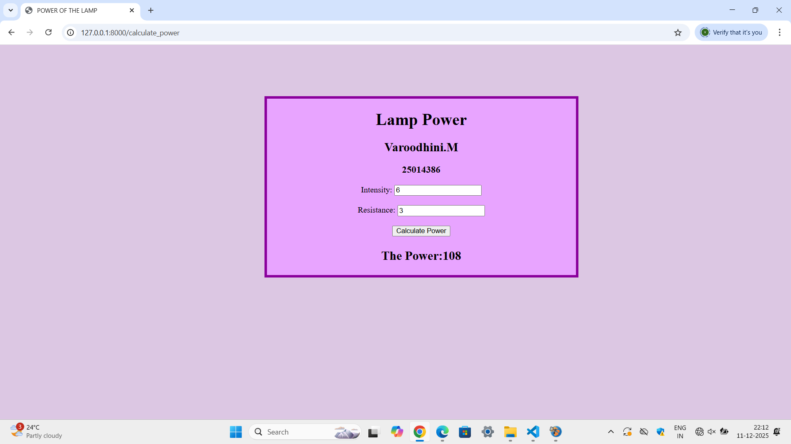

# Ex.05 Design a Website for Server Side Processing
# Date:11-12-2025
# AIM:
To design a website to calculate the power of a lamp filament in an incandescent bulb in the server side.

# FORMULA:
P = I2R
P --> Power (in watts)
 I --> Intensity
 R --> Resistance

# DESIGN STEPS:
## Step 1:
Clone the repository from GitHub.

## Step 2:
Create Django Admin project.

## Step 3:
Create a New App under the Django Admin project.

## Step 4:
Create python programs for views and urls to perform server side processing.

## Step 5:
Create a HTML file to implement form based input and output.

## Step 6:
Publish the website in the given URL.

# PROGRAM :
file.html
```
<html>
    <head>
        <title>POWER OF THE LAMP</title>
        <style>
            body{
                background-color: #dcc7e3;
            }
            .box{
                margin-left:100px;
                margin-top:100px;
                background-color: rgb(232, 164, 255);
                border:solid 5px rgb(138, 0, 156);
                width:600px;
                height:auto;
            }
        </style>
    </head>        
    <body>
        <center>
        <div class="box">
            <h1 align="center">Lamp Power</h2>
            <h2 align="center">Varoodhini.M</h4>
            <h3 align="center">25014386</h4>
        <form method="POST" action="/calculate_power">
            
            <label>Intensity:</label>
            <input type="number" name="intensity" value="{{request.POST.intensity}}">
            <br><br>

            <label>Resistance:</label>
            <input type="number" name="resistance" value="{{request.POST.resistance}}">
            <br><br>

            <button type="submit">Calculate Power</button>
        </form>
        <h2><p>The Power:{{Power}}</p></h2>
        </div>
        </center>
    </body>
</html>
```
views.py
```
from django.shortcuts import render
def home(request):
    return render(request,"file.html")
def calculate_power(request):
    if request.method=="POST":
        intensity=int(request.POST.get("intensity"))
        resistance=int(request.POST.get("resistance"))
        power=(intensity**2)*resistance
        print(f"Intensity:{intensity},Resistance:{resistance},Power:{power}")
        return render(request,"file.html",{"Power":power})
        return render(request,"file.html")
```
urls.py
```
from django.contrib import admin
from django.urls import path
from myapp import views

urlpatterns = [
    path('admin/', admin.site.urls),
    path('',views.home,name='home'),
    path('calculate_power',views.calculate_power,name='calculate_power'),
]
```

# HOMEPAGE:




# RESULT:
The program for performing server side processing is completed successfully.
